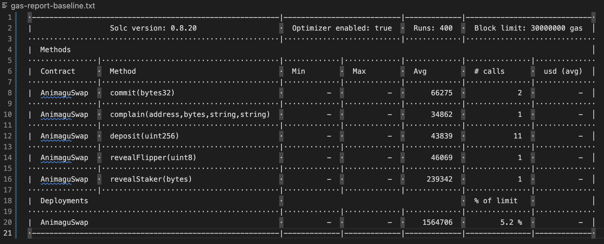

# AnimaguSwap
## 1 What is AnimaguSwap
- A novel Uniswap protocol that mitigates Sandwich Attacks in AMM 

- The scenario involves a user wishing to exchange tokens on Uniswap, using Token A to purchase Token B. We establish a defense mechanism by grouping flippers and stakers among nodes, creating distrust.
## 2 Project Framework
- Hardhat 

- Fork from the ETH Mainnet

- Github: https://github.com/RyanFcr/AnimaguSwap
## 3 Project Limitation
- Instead of genuinely simulating N nodes locally, I emulate N wallet accounts using local variables.

- Some communication details have been omitted, with a primary focus on the contract aspect, the overall system implementation and the performance of the entire system, specifically in terms of gas fees.
## 4 Performance

### Baseline

- Forking ETH Mainnet
- wBTC->DAI
- AmountIn = 100000000n; AmountOutMin = 26283178705806160790323n
  - swap 100000000n wBTC to 26283178705806160790323n DAI
- Staker Number: 10
- Secret sharing  threshold: 10

## 5 Usage

1. yarn install & fill up .env file
2. yarn deploy
3. npx hardhat test

